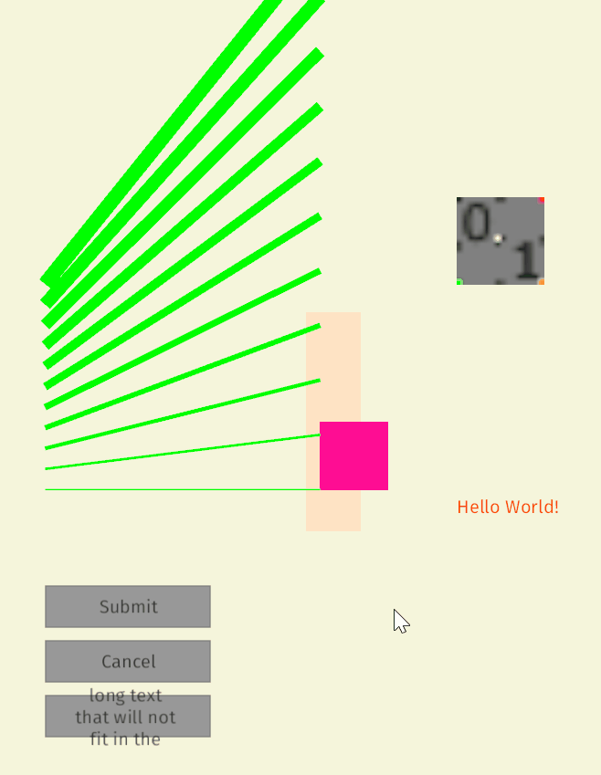

# 🐕 Bevy Keith

[](./LICENSE)
[](https://docs.rs/bevy_keith)
[](https://crates.io/crates/bevy_keith)
[](https://github.com/bevyengine/bevy/blob/main/docs/plugins_guidelines.md#main-branch-tracking)


2D graphic library inspired by Piet (📦 [`piet`](https://crates.io/crates/piet)) for the [Bevy game engine](https://bevyengine.org/).

Currently a purely immediate-mode library, but with future plans to explore partial retaining to reduce CPU usage.



## Usage

Add a dependency to `Cargo.toml`:

```toml
[dependencies]
bevy_keith = "0.0.2"
```

Add the `KeithPlugin` to your Bevy app:

```rust
App::default()
    .add_plugins(DefaultPlugins)
    .add_plugin(KeithPlugin);
```

Add a `Canvas` component where you want to draw. If you add the `Canvas` on the same `Entity` as an `OrthographicProjection` component, then the canvas automatically resizes to the full orthographic camera area.

```rust
// Only for initial setup, or if controlled manually
let mut canvas = Canvas::new(Rect {
    min: Vec2::splat(-400.),
    max: Vec2::splat(100.),
});

// Optionally clear the canvas with a given color before drawing
canvas.set_background_color(Some(Color::BEIGE));

// Spawn on the same Entity as an OrthographicProjection for auto-resize
commands
    .spawn_bundle(Camera2dBundle::default())
    .insert(canvas);
```

Draw something on the `Canvas` via a `RenderContext`:

```rust
fn run(mut query: Query<&mut Canvas>) {
    let mut canvas = query.single_mut();
    canvas.clear();

    let mut ctx = canvas.render_context();

    // Draw a filled rectangle
    let brush = ctx.solid_brush(Color::PINK);
    let rect = Rect {
        min: Vec2::ZERO,
        max: Vec2::splat(50.),
    };
    ctx.fill(rect, &brush);

    // Draw a text
    let text = ctx
        .new_layout("Hello World!")
        .color(Color::ORANGE_RED)
        .font(...)
        .font_size(24.)
        .build();
    ctx.draw_text(text, Vec2::ZERO);

    // Draw a textured rectangle
    let rect = Rect {
        min: Vec2::new(100., 150.),
        max: Vec2::new(116., 166.),
    };
    ctx.draw_image(rect, my_res.image.clone());

    // Draw some lines
    let brush = ctx.solid_brush(Color::GREEN);
    for i in 0..=10 {
        ctx.line(Vec2::new(-200.5, 0.5 + i as f32 * 15.), Vec2::new(0.5, 0.5 + i as f32 * 40.), &brush, 1. + i as f32);
    }
}
```

## Features

- [ ] Primitives
  - [x] Text
  - [x] Axis-aligned rectangle
    - [x] Fill
    - [x] Stroke
  - [x] Single line
  - [ ] Polyline
